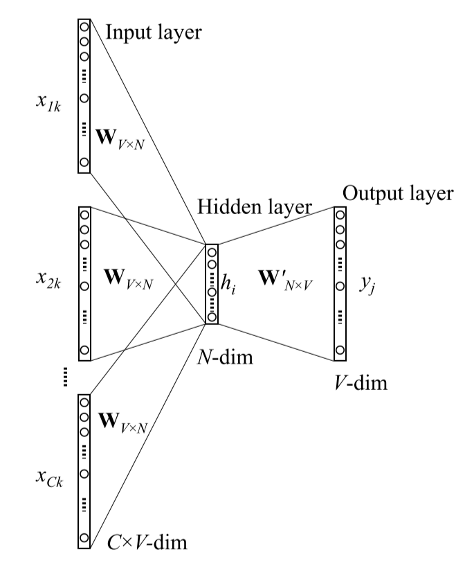

# Word Embeddings

将词“嵌入”（映射）到数值向量，这个数值向量有表征语义的功能

## Word2Vec

### Basic Models

#### CBOW (Continuous Bag-Of-Words)

对于给定的一个中心词 (Center word)，用它的上下文单词 (Context word) 作为输入，来预测这个词。

假设词汇表大小为$V$，词向量的维度为$N$。当上下文只有一个词$w_I$的时候（相当于bigram），Word2Vec可以用如下简化的的神经网络表示

该神经网络的输入$\bold{x}$为$w_I$的One-Hot Encoding形式，只有一个隐层$\bold{h}$，并且隐层使用线性激活函数，而输出层使用softmax激活函数，输出向量$\bold{y}$表示每个单词在给定$w_I$时中心词为其他各单词的概率。因此前向传播可以表示为
$$
\bold{v}_{w_I} = \bold{W}^T\bold{x} = \bold{W}_{k,\cdot}^T \\
\bold{h} = \bold{v}_{w_I} \\
\bold{u} = \bold{W'}^T \bold{h} \\
\bold{y} = softmax(\bold{u}) \\
p(w_j | w_I) = y_j = \frac{\exp{u_j}}{\sum_{k=1}^V \exp{u_k}}
$$

由于$\bold{x}$是One-Hot Encoding，如果$x_k=1$则$\bold{v}_{w_I}$实际上是权重矩阵$\bold{W}$的第$k$行。

我们希望真实的中心词$w_O$出现的概率最大，因此使用极大似然估计最大化$w_O$的概率，即
$$
\max p(w_O | w_I) = \max  y_{j^*}
$$
其中$j^*$是$w_O$在输出向量$\bold{y}$中的下标。而最大化$p(w_O | w_I)$相当于最大化$\log p(w_O | w_I)$，因此我们将损失函数定义为
$$
\begin{aligned}
E &= -\log p(w_O | w_I) \\
&= -\log y_{j^*} \\
&= -\log\frac{\exp u_{j^*}}{\sum_{k=1}^V \exp{u_k}} \\
&= - u_{j^*}+ \log\sum_{k=1}^V \exp u_k
\end{aligned}
$$

然后就可以用梯度下降训练该神经网络了（反向传播具体的求导过程可参考参考文献1）。训练结束后就可以用神经网络的隐层作为词向量了，由于隐层$\bold{h}$实际上就是权重矩阵$W$的某个行，因此$W$也就是词向量矩阵了，其中第$k$行就是第$k$个单词的词向量。

不过显然上下文单词只有一个的时候结果并不准确。当使用更多的上下文单词（$C$个）时，网络结构可以变化为

这时候网络的输入变成了$C$个上下文单词$w_1, w_2, \ldots, w_C$的平均值，即
$$
\begin{aligned}
\bold{h} &= \frac{1}{C}\bold{W}^T(\bold{x}_1+\bold{x}_2+\ldots+\bold{x}_C) \\
&= \frac{1}{C}(\bold{v}_{w_1}+\bold{v}_{w_2}+\ldots+\bold{v}_{w_C})^T
\end{aligned}
$$
然后损失函数也可改写为
$$
\begin{aligned}
E &= -\log p(w_O | w_1, w_2, \ldots, w_C) \\ 
&= - u_{j^*} + \log\sum_{k=1}^V \exp u_k
\end{aligned}
$$
同样可以使用梯度下降的方法训练。

#### Skip-gram

对于给定的一个中心词 ，用它作为输入，来预测这个词的上下文单词。

与只有一个上下文单词的CBOW相似，Skip-gram的输入为中心词$w_I$的One-Hot Encoding，而输出$\bold{y}_1, \bold{y}_2, \ldots, \bold{y}_C$表示对应每个上下文单词的概率分布，如下图所示

注意图中虽然画了多个$W'_{N\times V}$，但实际上它们都是相同的一个权重矩阵，因此$\bold{y}_1, \bold{y}_2, \ldots, \bold{y}_C$实际上也是相同的。因此该神经网络的前向传播与只有一个上下文单词的CBOW是完全相同的，只不过输出的意义变为给定中心词$w_I$第$c$个上下文单词的概率分布，即
$$
p(w_{c,j} | w_I) = y_{c,j} = y_j = \frac{\exp u_j}{\sum_{k=1}^V \exp u_k}
$$
其中$w_{c,j}$表示第$c$个词为$w_j$。

而损失函数变为
$$
\begin{aligned}
E &= -\log p(w_1, w_2, \ldots, w_C | w_I) \\
&= -\sum_{c=1}^C \log p(w_c | w_I) \\
&= -\sum_{c=1}^C \log \frac{\exp u_{j_c^*}}{\sum_{k=1}^V \exp u_k} \\
&= - \sum_{c=1}^C u_{j_c^*} + C \cdot \log \sum_{k=1}^V \exp u_k
\end{aligned}
$$
其中$w_1, w_2, \ldots, w_C$是真实的上下文单词，$j_c^*$为第$c$个真实上下文单词在$\bold{y}$中的下标。同样可以用梯度下降法去训练。

### Optimizations

#### Hierarchical Softmax

#### Negative Sampling

## GloVe

## FastText

## References

1. Rong X. word2vec Parameter Learning Explained.[J]. arXiv: Computation and Language, 2014. 